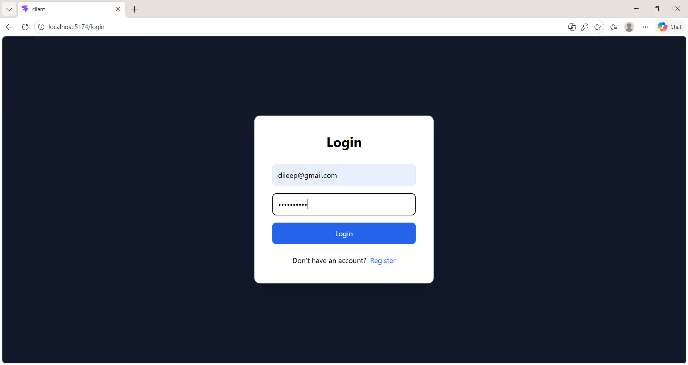
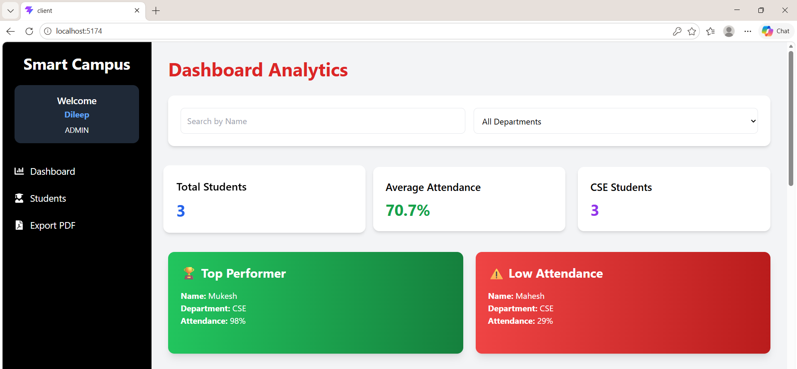
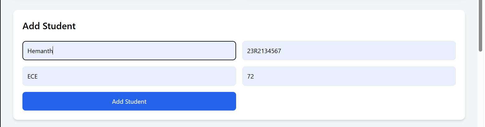
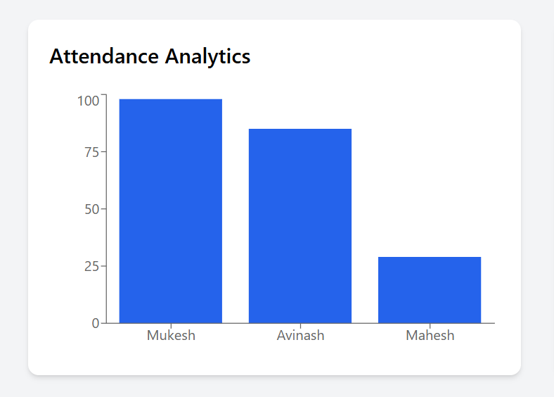
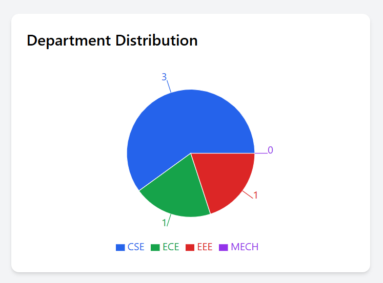
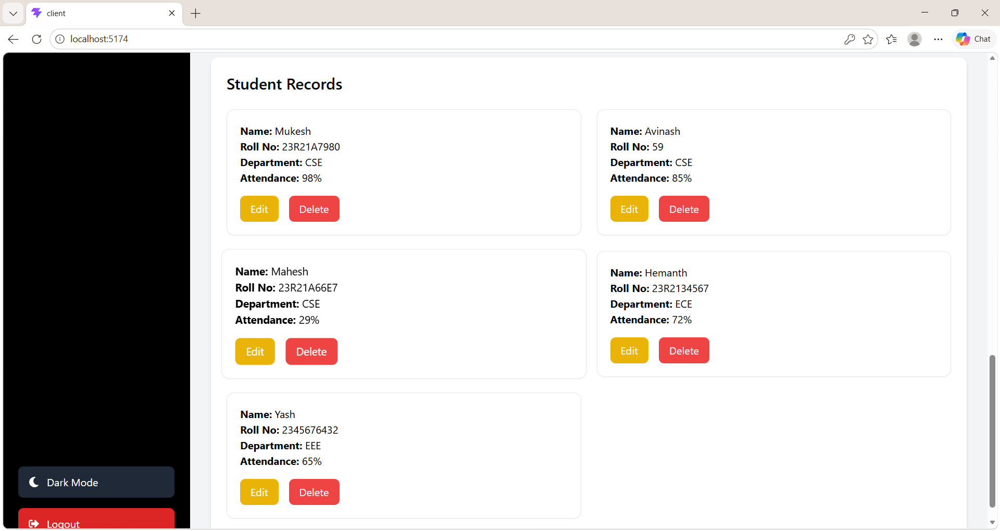
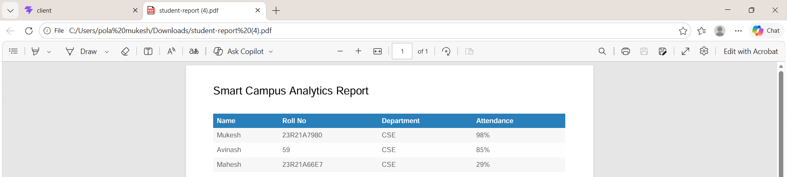

# 🎓 Smart Campus Analytics Dashboard

A full-stack MERN application built for managing and analyzing student attendance data with authentication, analytics dashboards, charts, PDF export, CRUD operations, and modern UI features.

---

# 🚀 Project Overview

Smart Campus Analytics is a modern student management and attendance analytics platform designed to help institutions efficiently manage student records, attendance tracking, and dashboard analytics.

The project includes secure authentication, interactive analytics charts, attendance monitoring, PDF export functionality, dark mode support, and a responsive user interface.

---

# ✨ Features

## 🔐 Authentication System
- Student Login
- Admin Login
- User Registration
- JWT Authentication
- Protected Dashboard Access
- Secure Token Storage
- Logout Functionality

---

# 👨‍🎓 Student Management System

## CRUD Operations
- Add Student
- Edit Student
- Delete Student
- View Student Records

## Student Details
- Student Name
- Roll Number
- Department
- Attendance Percentage

---

# 📊 Analytics Dashboard

## Dashboard Statistics
- Total Students
- Average Attendance
- Department-wise Student Count
- Top Performer
- Low Attendance Students

---

# 📈 Data Visualization

## Charts Included
- Attendance Analytics Bar Chart
- Department Distribution Pie Chart

Built using:
- Recharts Library

---

# 📄 PDF Export Feature

- Export student records as PDF
- Download attendance reports
- Generate printable analytics data

---

# 🔍 Search & Filter Features

- Search students by name
- Filter by department
- Real-time filtering system

---

# 🌙 UI / UX Features

- Dark Mode / Light Mode
- Fully Responsive Design
- Modern Dashboard Interface
- Professional Card Layout
- Mobile-Friendly UI
- Smooth User Experience

---

# 🛠️ Tech Stack

## Frontend
- React.js
- Vite
- Tailwind CSS
- React Router DOM
- Recharts

## Backend
- Node.js
- Express.js
- MongoDB
- Mongoose

## Authentication & Security
- JWT (jsonwebtoken)
- bcryptjs

## Additional Libraries
- jsPDF
- html2canvas

---

# 📂 Project Structure

```bash
SmartCampus-Analytics/
│
├── client/
│   ├── src/
│   ├── pages/
│   ├── App.jsx
│   └── main.jsx
│
├── backend/
│   ├── models/
│   ├── routes/
│   ├── server.js
│   └── .env
│
├── screenshots/
│
└── README.md
```

---

# ⚙️ Installation & Setup

## 1️⃣ Clone Repository

```bash
git clone https://github.com/polamukesh/Smart-Campus-Analytics.git
```

---

## 2️⃣ Install Frontend Dependencies

```bash
cd client
npm install
```

---

## 3️⃣ Install Backend Dependencies

```bash
cd ../backend
npm install
```

---

# ▶️ Run the Project

## Start Backend Server

```bash
cd backend
npx nodemon server.js
```

Backend runs on:

```bash
http://localhost:5000
```

---

## Start Frontend

```bash
cd client
npm run dev
```

Frontend runs on:

```bash
http://localhost:5173
```

---

# 🔑 Environment Variables

Create a `.env` file inside backend folder.

```env
MONGO_URI=your_mongodb_connection_string
JWT_SECRET=your_secret_key
PORT=5000
```

---

# 📸 Project Screenshots

## 🔐 Login & Register System



---

## 📊 Dashboard Overview



---

## ➕ Add Student Module



---

## 📈 Attendance Analytics



---

## 🥧 Department Distribution



---

## 👨‍🎓 Student Records



---

## 📄 PDF Export Feature



---

# 🔥 Future Enhancements

- Daily Attendance Tracking
- Student Profile Photos
- Role-Based Access Control
- MongoDB Atlas Deployment
- Vercel + Render Deployment
- Advanced Analytics
- Pagination
- Loading Animations
- Admin Dashboard Controls

---

# 📚 Learning Outcomes

This project helped in learning:

- Full Stack MERN Development
- REST API Development
- Authentication & Authorization
- MongoDB Database Handling
- React State Management
- Data Visualization
- Dashboard UI Design
- Responsive Web Development
- JWT Security Implementation
- PDF Generation

---

# 👨‍💻 Author

## Mukesh Pola

